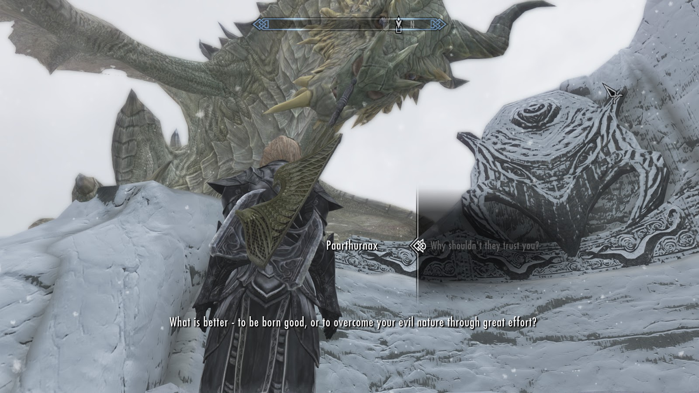

最近，看完了 *Mindset，The New Psychology of Success*， 作者是Carol S.Dwecks．我的感受是相见恨晚：如果我早一点看到这本书，也许我会活得不一样．

这本书说起来主题并不复杂，是关于两种思维模式（mindset）的：固定型思维模式，成长型思维模式．所谓固定型思维模式，是指认为人的性格和能力都是天生的，无法成长的；成长型思维模式，则认为人的各种特质和能力都是可以培养和成长的．

面对挑战，固定型思维模式的人会害怕失败，因为一件事的失败就意味着自己整个人的失败，说明自己智力或体力、性格上的 *永久* 缺陷，自己会被这失败所定义；而在成长型思维的人看来，没有比通过努力完成一件事更好的事情了，成功了当然好，失败了不过意味着自己 *暂时* 能力不够，需要再接再厉，而且更重要的是，自己一定会从中学到些什么．这两种不同的心态，哪一种会让人一直踌躇不前，哪一种会让人保持自我提升，相信不用我来评判了．

我自己就是一个很好的例子．从小，我在周围同龄人中算是成绩很好的，也算是比较用功．但回想起来我发现，我其实是固定型思维模式的人．对我来说，考个好成绩是证明我天生聪明的方式．也许一开始我确实有好学的天性，但慢慢地，有意无意地，我产生了＂聪明的学生不用像笨学生一样努力＂的想法．这样的想法在高中以后让我吃尽了苦头，让我从来没能全心全意去学习，去追寻自己的梦想．许多事情我都没法全力以赴，因为潜意识里我害怕失败的风险：尽全力了还失败会证明我彻头彻尾的无能，只用五成功力的话，失败了我至少有个推脱的借口．

幸好，我好像慢慢醒悟了．从一个谈学画画的公众号里看见了对这本书的推荐，惊觉这正是我所需要的．作者将固定型思维模式的人心里的那些小九九分析得很明白，看的过程数次感觉脸红，但也进而觉得踏实了，之前觉得似乎不可见人的想法也不过是众人都有的普遍心理罢了．我需要做的，是慢慢作出改变．

>"What is better - to be born good, or to overcome your evil nature through great effort?"  
-- Paarthurnax, from The Elder Scrolls V: Skyrim.
